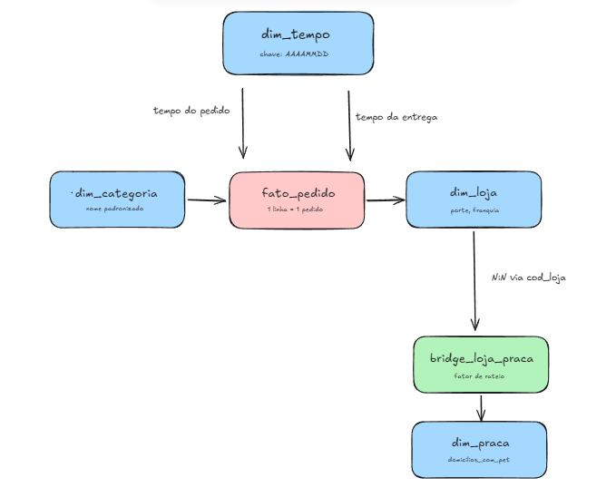

# Mini-projeto avaliativo do curso análise de dados com python - Pata Amiga

## Contexto

A Pata Amiga é uma rede catarinense de pet shops, com 32 lojas espalhadas por Santa Catarina. Em setembro de 2023 a rede começou a vender também por app, site, telefone e WhatsApp, além da loja física — e em sete meses (set/2023 a mar/2024) juntou 4.044 pedidos.

O problema é que esses sete meses de dados vivem em três sistemas que não se falam: a plataforma de e-commerce (pedidos e marcos da entrega), o cadastro de lojas do franchising, e a planilha de praças de atendimento que o time de expansão mantém à parte. Cada sistema escreve do seu jeito — nome de loja com e sem acento, categoria com várias grafias, data e dinheiro como texto — e isso trava qualquer análise direta.

Este repositório organiza esses três sistemas num modelo dimensional (esquema estrela) no MySQL, para responder cinco perguntas da diretoria: onde está o gargalo da entrega, qual categoria sustenta o faturamento, se o desconto funciona igual em todo canal, qual praça concentra faturamento, e onde abrir a próxima loja.

## Diagnóstico da origem (Tarefa 1)

Depois de rodar `01-carga-staging.sql`, a staging chega assim:

- **stg_pedido**: 4.044 linhas, todas as colunas em texto (data, valor em reais e quantidade incluídos).
- **stg_loja**: 32 linhas — o cadastro atual das lojas, a "foto de hoje".
- **stg_loja_praca**: 48 linhas — cada loja aparece uma vez para cada praça que atende.

Os problemas que encontrei:

- **Grafias de loja**: 50 grafias distintas para as 32 lojas reais — o mesmo nome aparece com acento, sem acento, em caixa alta, com "/SC" no fim e com pelo menos um erro de digitação. Esse número varia um pouco de banco para banco (a collation do MySQL já trata "Timbó" e "TIMBO" como o mesmo texto), então o que importa de verdade é que, depois da padronização, sobrem exatamente as 32 lojas.
- **Grafias de categoria**: 18 grafias distintas para as 7 categorias reais (esperado no MySQL 8; também varia por collation, pelo mesmo motivo).
- **Cod Loja vazio**: 1.575 pedidos (≈39% da base) não têm o código da loja preenchido — por isso o cruzamento com a loja precisa ser feito pelo nome, não pelo código.
- **Sem nome de loja**: 3 pedidos não têm nem código nem nome de loja. Esses caem na linha -1 da dim_loja.
- **Marcos do processo em branco**: aqui separei os quatro de propósito, porque eles não são números que se somam — um pedido sem separação normalmente também não tem nota, despacho nem entrega, então somar os quatro conta o mesmo pedido várias vezes. Cada um, sobre os 4.044 pedidos:
  - `Dt Separacao Estoque` em branco: **1.077**
  - `DtNotaFiscal` em branco: **1.338**
  - `Dt_Despacho_Transportadora` em branco: **1.665**
  - `DtEntregaCliente` em branco: **1.953**

  Marco em branco não é erro — é processo em aberto. 1.953 pedidos ainda não tinham sido entregues até o fim da janela de dados (31/03/2024), e cada marco em branco vira `NULL` no cálculo dos dias, nunca zero (um zero ali faria o gargalo da P1 parecer mais rápido do que realmente é).

## Decisões de tratamento (Tarefa 2)

**Datas.** A tabela mistura dois formatos na mesma linha: `DtHoraPedido` e `DtHoraIntegracaoERP` vêm no padrão americano com AM/PM (`11/16/2023 02:30 PM`), enquanto os quatro marcos da entrega já vêm em ISO (`2023-11-16`). Usei `STR_TO_DATE(coluna, '%m/%d/%Y %h:%i %p')` só nas duas primeiras. Usar a máscara brasileira aqui não dá erro — só devolve `NULL` ou datas trocadas, em silêncio — por isso conferi o período resultante (01/09/2023 a 31/03/2024) antes de seguir.

**Dinheiro.** `vl_liquido` mistura `"R$ 1.850,00"`, `"1850.00"`, `"1.200"`, `"-"` e vazio na mesma coluna. Vazio e `"-"` viram `NULL`, nunca zero — um zero ali derrubaria a média e o total sem motivo.

**Categoria — a ordem do CASE importa.** "Ração Medicamentosa" contém as letras "RA", então testar RA antes de MED jogaria esse item para a categoria errada. Ordem usada: MED → PETISC → RA → HIG → BRINQ → ACESS → SERV → Nao Informado, tudo em UPPER e sem acento no texto comparado.

**Nome da loja — REPLACE antes do CASE.** Primeiro tirei o sufixo "/SC" e o espaço duplo (mecânico, com REPLACE). Só sobraram três grafias que não são questão de acento e precisaram de decisão manual: "BLUMENAL" → Blumenau Centro (erro de digitação), "FLORIPA" → Florianópolis Norte (apelido), "JGUA" → Jaraguá do Sul (abreviação). Fazer isso na ordem errada — CASE antes do REPLACE — faria o lookup falhar sem avisar.

**Desconto e canal.** Ficam direto na fato, não viram dimensão — são poucos valores, sem nenhum atributo pendurado neles. O desconto cai em três grupos (Sim / Nao / Nao Informado), comparando em UPPER e com TRIM nas pontas. No canal, testei WHATS antes de APP, porque "WHATSAPP" contém "APP" — testar na ordem errada jogaria os pedidos de WhatsApp para dentro do App.

## O modelo (esquema estrela)

`fato_pedido` no centro, grão de **1 linha = 1 pedido** (4.044 linhas). Ao redor:

- **dim_loja** e **dim_categoria**, ligadas direto à fato.
- **dim_tempo**, ligada **duas vezes** — uma para a data do pedido, outra para a data da entrega. É a mesma tabela usada em dois papéis (role-playing dimension); a chave dela é a própria data em número (ex.: `20231116`), então a fato monta essa FK por conversão, sem precisar de JOIN.
- **dim_praca**, que **não** se liga direto à fato: ela é alcançada através da `bridge_loja_praca`, porque uma loja pode entregar em mais de uma praça (relação N:N). É o único caminho indireto do modelo.

| Tabela | Chave | Alguns atributos |
|---|---|---|
| fato_pedido | sk_pedido | sk_loja, sk_categoria, sk_tempo_pedido, sk_tempo_entrega, vl_liquido |
| dim_tempo | sk_tempo | data, dia_semana, mes, ano |
| dim_loja | sk_loja | chave_loja, porte, faixa_franquia |
| dim_categoria | sk_categoria | categoria_origem, nome_categoria, grupo_categoria |
| dim_praca | sk_praca | cod_praca, nome_praca, domicilios_com_pet |
| bridge_loja_praca | cod_loja + sk_praca | fator_publico |

## Como reproduzir o banco do zero

Dentro da pasta `sql/`, nesta ordem:

1. `01-carga-staging.sql` — cria o banco e carrega as três tabelas de origem.
2. `02-dimensoes-prontas.sql` — cria todas as tabelas do modelo e já popula `dim_tempo` e `dim_loja`.
3. `03-dimensoes.sql` — popula `dim_categoria`, `dim_praca` e `bridge_loja_praca`.
4. `04-fato.sql` — popula `fato_pedido` num único `INSERT... SELECT`.
5. `05-perguntas.sql` — as cinco consultas de negócio.

`00-conferencia.sql` não é entrega — é o arquivo de teste usado para conferir cada etapa contra os números esperados, sempre logo depois de rodar o script correspondente.

## As cinco respostas

**P1 — Onde está o gargalo da entrega?**
O tempo médio do pedido até a entrega é de **9,0 dias**. O intervalo mais lento é sempre o mesmo, em qualquer porte de loja: **nota fiscal → despacho** (3,3 dias nas lojas grande e média, 8,5 dias nas pequenas). O gargalo não muda de lugar entre os portes, mas é bem mais grave nas lojas pequenas, que levam quase o dobro do tempo total (15,2 dias) das lojas grandes (7,9 dias).

**P2 — Qual categoria concentra o faturamento?**
Ração, com folga: R$ 1.076.203, ou **60% do faturamento da rede**. Depois vem Medicamento (17%) e Petisco (7%). Conferi também por porte de loja — Ração lidera nos três portes, então a resposta não muda dependendo do tamanho da loja.

**P3 — O desconto funciona igual em todo canal?**
Não exatamente igual, mas na mesma direção: em todos os canais o ticket médio com desconto é bem mais alto que sem desconto (ex.: App R$ 488 com desconto contra R$ 170 sem). Isso não quer dizer que o desconto "causa" ticket maior — pode ser que pedidos maiores recebam desconto com mais frequência, e não o contrário. O canal com mais faturamento é o App (≈31%), seguido do Site (≈25%); o WhatsApp aparece com 414 pedidos, confirmando que o de-para do canal foi aplicado na ordem certa.

**P4 — Qual praça concentra o faturamento?**
Vale do Itajaí, com **35% do faturamento rateado** (R$ 633.746) — e também é a praça com mais domicílios com pet (148 mil). Mas faturamento não anda sempre junto com o tamanho do mercado: Norte Industrial fatura 9,8% do total com só 96 mil domicílios, enquanto Litoral Sul fatura 7,6% com 58 mil — tem praça rendendo acima do que o tamanho dela sugere.

**P5 — Onde abrir a próxima loja, e o que os dados não sustentam?**

a) As lojas com maior venda por mil habitantes são Rio dos Cedros (41,9) e Presidente Getúlio (34,8) — cidades pequenas com demanda forte, mas com entrega mais lenta (14 dias), sinal de logística ainda não madura ali.

b) Por faixa de franquia, Ouro concentra 56% do faturamento — mas essa faixa é a foto de HOJE do cadastro, não a de quando o pedido foi feito. Uma loja que virou Ouro em fevereiro de 2024 aparece como Ouro em todos os pedidos dela, inclusive nos de setembro de 2023. Não dá para responder "quanto do faturamento veio de lojas que já eram Ouro na data do pedido", porque esse histórico não existe no cadastro — só o retrato atual.

c) O que ficou de fora: 3 pedidos sem loja identificada, 1.953 entregas ainda em aberto (quase metade da base), 257 pedidos com item em branco e 121 com valor em branco.

**Recomendação.** Os dados não apontam um vencedor óbvio. Rio dos Cedros e Presidente Getúlio têm a maior demanda per capita, mas já ficam dentro da praça Vale do Itajaí, que sozinha concentra 35% do faturamento — abrir mais uma loja ali arrisca dividir vendas com as lojas que já existem, não necessariamente crescer o total. Norte Industrial fatura desproporcionalmente acima do seu tamanho de mercado, o que pode ser sinal de espaço ainda não saturado — mas com só 7 meses de dados e nenhuma informação sobre concorrência local, isso é indício, não prova. Eu recomendaria estudar Norte Industrial com mais profundidade antes de decidir, e não recomendaria abrir em Vale do Itajaí sem antes entender se as lojas de lá já estão no limite de capacidade.

## Vídeo

Link drive: https://drive.google.com/file/d/1DIIjNFuLVgNLDI1kSMcEgCAk989aGt6Z/view?usp=sharing
Por: Julia Rafaela Ramos Segundo